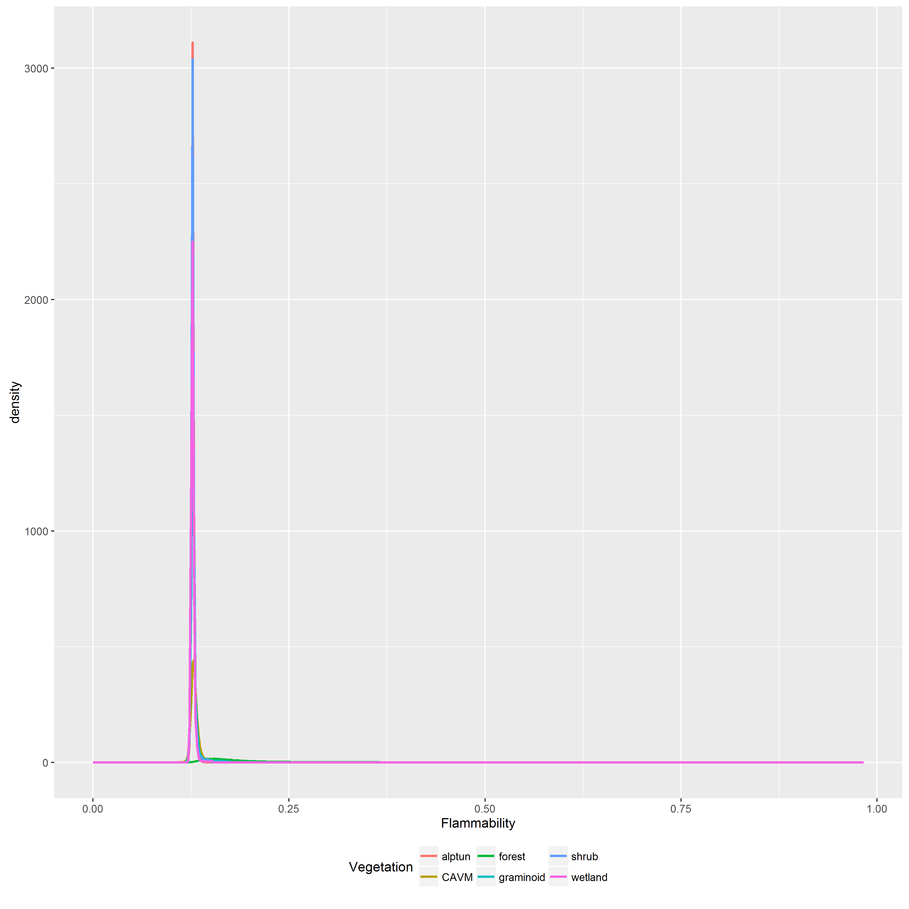
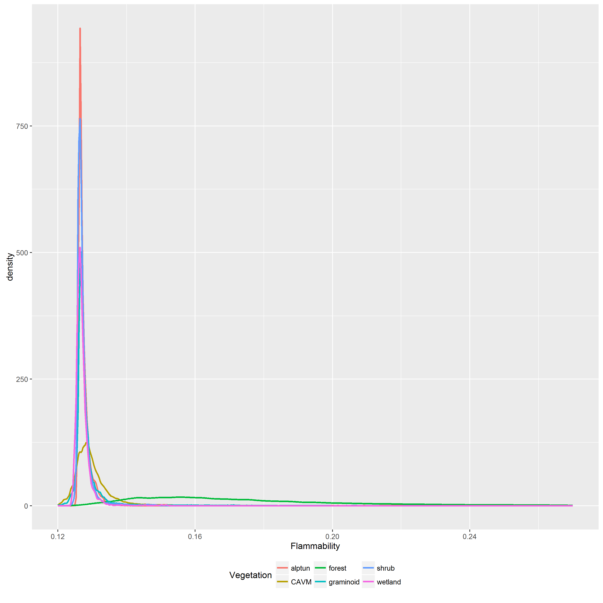
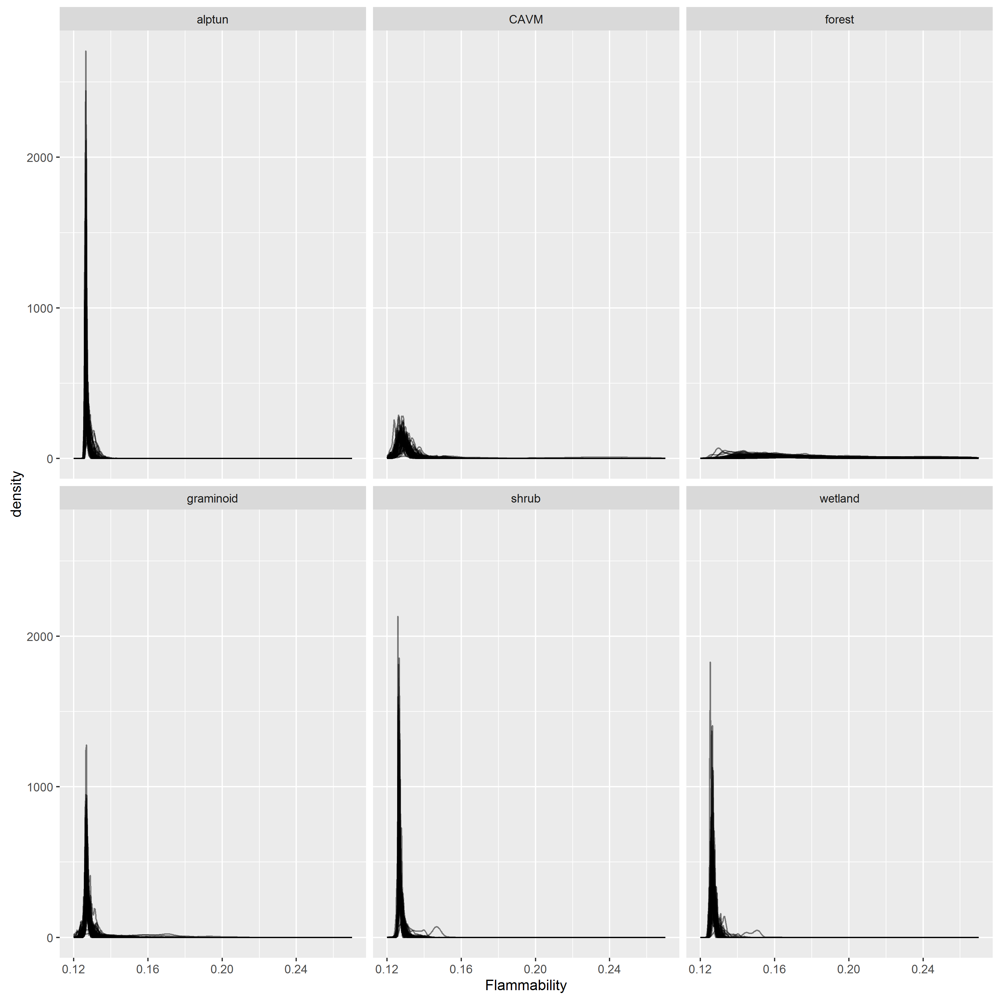

##
##
## Exploratory plots of marginal and conditional flammability distributions.

Each plot is broken out by vegetation class, alpine tundra, boreal forest, combined CAVM tundra, and each of three CAVM component classes, shrub, graminoid, and wetland tundra.

### Marginal distribution

The first plot shows a density function proportional to joint probability distribution for flammability in time and space,
marginalized with repsect to time. The time period is 1950 - 2013. The second plot is the same, but with flammability truncated to [0.12, 0.27].

### Conditional distribution

This plot shows multiple overlapping spatial flammability distributions conditioned on each year, also truncated to [0.12, 0.27].

The table below provides distribution quantiles by vegetation class.

Table: Critical values associated with flammability by vegetation class

Vegetation     Pct05    Pct10    Pct25    Pct50    Pct75    Pct90    Pct95
-----------  -------  -------  -------  -------  -------  -------  -------
CAVM          0.1238   0.1250   0.1267   0.1288   0.1317   0.1361   0.1408
shrub         0.1257   0.1258   0.1262   0.1267   0.1276   0.1292   0.1308
graminoid     0.1252   0.1258   0.1265   0.1272   0.1285   0.1314   0.1354
wetland       0.1250   0.1254   0.1260   0.1267   0.1276   0.1290   0.1303
alptun        0.1259   0.1260   0.1264   0.1269   0.1279   0.1295   0.1309
forest        0.1361   0.1408   0.1513   0.1688   0.1983   0.2519   0.3167
