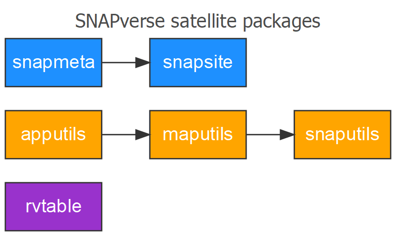

<!-- README.md is generated from README.Rmd. Please edit that file -->
maputils
========

[](https://travis-ci.org/leonawicz/maputils) [](https://ci.appveyor.com/project/leonawicz/maputils) [](https://codecov.io/github/leonawicz/maputils?branch=master)

`maputils` contains Leaflet-related utilities for Shiny app development in a SNAP context. The package inherits from [`apputils`](https://leonawicz.github.io/apputils/), which contains common utility functions, settings and references for use across multiple Shiny apps. It is also imported by [`snaputils`](https://leonawicz.github.io/snaputils/), which contains more general utility functions and support for Shiny apps specific to a SNAP context. All three packages are satellite members of the [SNAPverse](https://leonawicz.github.io/snapverse/) collection of R packages.

`maputils` contains `SpatialPolygonsDataFrame` data sets useful in SNAP Shiny apps for visual representation of geographic regions via Leaflet maps. These data sets are simplified derivations of the maps offered by the [`snappoly`](https://leonawicz.github.io/snappoly/) package, containing fewer vertices. This allows them to be used for efficient map display in apps without slowing apps down due to unnecessarily high map resolution. Use the maps in `maputils` only for Leaflet widgets in apps. For data analysis, e.g., extracting data by polygon, use the higher resolution source maps in `snappoly`.

Each map is in WGS84 lon/lat rather than NAD83 Alaska Albers like the source maps in `snappoly`. There are slight differences in derived maps from the `snappoly` source maps as noted below.

There are ten available maps:

-   `akcan`: The full SNAP PRISM domain, a single union polygon of the State of Alaska and the five SNAP-relevant western Canadian provinces: Alberta, British Columbia, Manitoba, Saskatchewan and Yukon Territory.
-   `akcan2`: The same as `akcan`, but retaining the six distinct encompassing state/province polygons. See `snappoly::canada` for all provinces.
-   `ecoreg1`: Alaska level 1 ecological regions (ecoregions). Ecoregion maps are flattened, one map for each level, compared to `snappoly::ecoreg`.
-   `ecoreg2`: Alaska level 2 ecoregions.
-   `ecoreg3`: Alaska level 3 ecoregions.
-   `aklcc`: Alaska Landscape Conservation Cooperative.
-   `lcc`: Alaska and Canada Landscape Conservation Cooperative.
-   `cavm`: Circumpolar Arctic Vegetation (Alaska).
-   `fmz`: Alaska Fire Service fire management zones.
-   `tpa`: Terrestrial protected areas.

<p style="text-align:center;">

</p>
<br>

Installation
------------

You can install maputils from github with:

``` r
# install.packages('devtools')
devtools::install_github("leonawicz/maputils")
```

Reference
---------

The complete set of satellite packages is shown below.

<p style="text-align:center;">

</p>
<br>

[Complete package reference and function documentation](https://leonawicz.github.io/maputils/)
