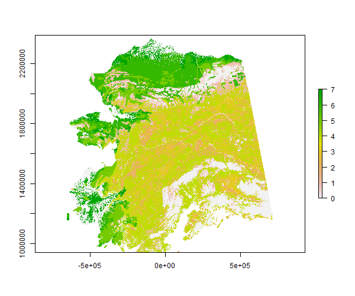

<!-- README.md is generated from README.Rmd. Please edit that file -->
snapgrid
========

[](https://travis-ci.org/leonawicz/snapgrid) [](https://ci.appveyor.com/project/leonawicz/snapgrid) [](https://codecov.io/github/leonawicz/snapgrid?branch=master)

The `snapgrid` package is a data package in the [SNAPverse](https://leonawicz.github.io/snapverse/) collection of R packages. It contains a number of convenient `raster` objects commonly used at SNAP. `snapgrid` contains a collection of rasterized maps focused on Alaska and Canada, including vegetation input for the ALFRESCO wildfire model, fire management options map layers, domain template layers for the Alaska "statewide" classic ALFRESCO domain, and 1-km ALFRESCO and 2-km climate templates for the Alaska/western Canada domain.

Available maps
--------------

The following maps are included in the package:

-   `akcan2km`: Alaska/western Canada 2-km downscaled climate domain template layer.
-   `akcan1km`: Alaska/western Canada 1-km ALFRESCO domain template layer.
-   `ak1km`: "Statewide" classic ALFRESCO domain template layer.
-   `swveg`: Vegation map layer for the classic "statewide" ALFRESCO model spatial domain.
-   `swfmo`: Statewide fire management options zones map layer.
-   `swratios`: Statewide fire management options zone ratios map layer.
-   `swflam`: Statewide GBM vegetation-mediated, climate-driven landscape flammability mask map layer.

Installation
------------

You can install snapgrid from github with:

``` r
# install.packages('devtools')
devtools::install_github("leonawicz/snapgrid")
```

Usage
-----

Data packages in the SNAPverse can be loaded on their own, though it is more typical to load data from a data package in the context of using the `snapstat` package, which provides a collection of functions that cater specifically to manipulating, analyzing and plotting SNAP data sets. This is relatively boilerplate and is mentioned for context, but for this package it is not that necessary.

Data sets from the above list can immediately be referred to directly once snappoly is loaded. To access documentation on the package from R, use `?snapgrid`, or for a data set for example, `?swveg`.

``` r
library(snapgrid)
swveg
#> class       : RasterLayer 
#> dimensions  : 1450, 1374, 1992300  (nrow, ncol, ncell)
#> resolution  : 1000, 1000  (x, y)
#> extent      : -656204.4, 717795.6, 940439.8, 2390440  (xmin, xmax, ymin, ymax)
#> coord. ref. : +proj=aea +lat_1=55 +lat_2=65 +lat_0=50 +lon_0=-154 +x_0=0 +y_0=0 +datum=NAD83 +units=m +no_defs +ellps=GRS80 +towgs84=0,0,0 
#> data source : in memory
#> names       : swveg 
#> values      : 0, 7  (min, max)
```

``` r
raster::plot(swveg)
```

<p style="text-align:center;">

</p>
Notes
-----

Cleaning and curating is kept to a minimum for this package. Included raster layers cover multiple spatial domains, namely Alaska and Alaska/western Canada, but they all share the NAD83 Alaska Albers Equal Area Conic projection in common:

`+proj=aea +lat_1=55 +lat_2=65 +lat_0=50 +lon_0=-154 +x_0=0 +y_0=0 +datum=NAD83 +units=m +no_defs +ellps=GRS80 +towgs84=0,0,0`

Reference
---------

[Complete package reference and function documentation](https://leonawicz.github.io/snapgrid/)
