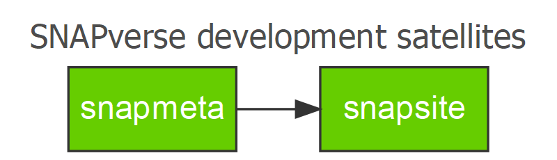

<!-- README.md is generated from README.Rmd. Please edit that file -->
snapsite
========

[](https://travis-ci.org/leonawicz/snapsite) [](https://ci.appveyor.com/project/leonawicz/snapsite) [](https://codecov.io/github/leonawicz/snapsite?branch=master)

`snapsite` contains a collection of utility functions for the development, maintenance and refinement of `pkgdown`-derived documentation across multiple [SNAPverse](https://leonawicz.github.io/snapverse/) packages. The core of the documentation for a SNAPverse package is based around pkgdown, which builds documentation for each package individually. The `snapsite` package assists with thematic tweaks and cohesive, standardized integration across multiple packages in the verse, helping to bring the SNAPverse together. It is not relevant to the SNAPverse outside of this development context. `snapsite` is a satellite package in the verse with `snapmeta` being the only SNAPverse package it is dependent on. It is not required by any other packages.

<p style="text-align:center;">

</p>
<br>

Installation
------------

You can install snapsite from github with:

``` r
# install.packages('devtools')
devtools::install_github("leonawicz/snapsite")
```

Usage
-----

This package is in early development. Examples are limited. At the moment it includes functions for generating flowcharts of the SNAPverse.

Reference
---------

[Complete package reference and function documentation](https://leonawicz.github.io/snaplocs/)
